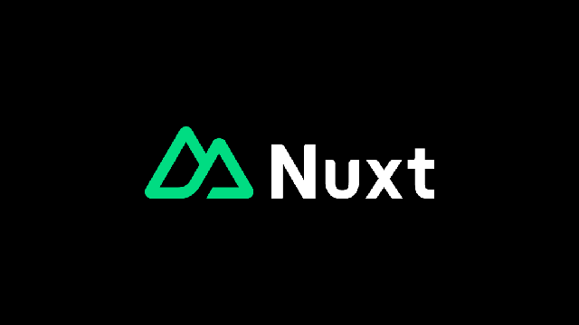

## Intro

Hace ya tiempo en [NextChance](https://nextchanceinvest.com/) que venimos usando [VueJS](https://vuejs.org/) y [NuxtJS](https://nuxt.com/) para el desarrollo de aplicaciones y, hace un par de días, hablando con [Carlos López](https://www.linkedin.com/in/carlos-lopez-perez/), lead frontend, nació la idea de montar mi blog en NuxtJS. Hasta ahora me había dedicado a trastear con otros [static site generators](https://jamstack.org/generators/), como [NextJS](https://nextjs.org/) o [GatsbyJS](https://www.gatsbyjs.com/), pero por alguna razón, no se me había pasado por la cabeza usar Nuxt para montar un blog. Así que, en este post, dejo reflejadas todas las acciones necesarias para montar un blog con Nuxt.

## Nuxt

[Nuxt](https://nuxt.com/) es un framework orientado a facilitar el desarrollo de aplicaciones basadas en VueJS.

[VueJS](https://vuejs.org/) es un framework (sí, otro más) para el desarrollo de interfaces web de usuario (la parte visible de las aplicaciones, o mejor dicho, el [frontend](https://wikipedia.org/wiki/Frontend_and_backend)) basado en [web components](https://wikipedia.org/wiki/Web_Components).

Aquí tienes un video bastante útil de introducción a Nuxt:

<iframe class="video" src="https://www.youtube.com/embed/dCxSsr5xuL8" title="Nuxt in 100 Seconds" frameborder="0" allow="accelerometer; autoplay; clipboard-write; encrypted-media; gyroscope; picture-in-picture; web-share" referrerpolicy="strict-origin-when-cross-origin" allowfullscreen></iframe>

También puedes realizar el [tutorial de inicio que ofrece Nuxt](https://nuxt.com/docs/getting-started).

## Requisitos

Antes de ponernos manos a la obra voy a listar los requisitos que debe cumplir el proyecto:

- Debe usar Nuxt.
- Debe persistir los artículos del blog en formato [Markdown](https://wikipedia.org/wiki/Markdown).
- Debe ser una web generada estáticamente alojada en [GitHub Pages](https://pages.github.com/).

## Creando un Proyecto con Nuxt Content

NuxtJS dispone de un CLI para generación de proyectos llamado [nuxi](https://github.com/nuxt/cli). Vamos a usar el comando [`nuxi init`](https://nuxt.com/docs/api/commands/init) para generar el proyecto:

```bash
npx nuxi init -t content nuxt-blog
```

He incluido en el comando el uso del template "content". Se trata de una [plantilla de proyecto](https://nuxt.new/) que viene preparada para gestionar contenido en markdown.

Te preguntará qué gestor de paquetes quieres usar, yo en mi caso he seleccionado [npm](https://npmjs.com/), y si quieres inicializar un repositorio git en el proyecto, absolutamente sí.

Una vez completado sólo tienes que acceder al directorio e iniciar el servidor de desarrollo:

```bash
cd nuxt-blog
npm run dev
```

Una vez arrancado el server es probable que pregunte para actualizar la fecha de compatibilidad, pulsa intro simplemente para confirmar y una vez que arranque el server puedes visitar [http://localhost:3000](http://localhost:3000).

Y voilà! ya tienes un proyecto en Nuxt capaz de renderizar markdowns.


La página que se está renderizando es un fichero markdown ubicado en `/content/index.md`. Puedes realizar cambios en el fichero y ver como se actualizan al guardarlo.

## Cómo Funciona Nuxt Content

La plantilla de Nuxt Content que estamos usando ya viene preparada para detectar los ficheros markdown que creemos dentro de `/content` y renderizarlos como páginas. Vamos a hacer la prueba.

Creamos un fichero nuevo en `/content/mi-primer-post.md` con el siguiente contenido:

```markdown
# Primer Post

Este es mi primer post en el blog.
```

Y de paso vamos a editar `/content/index.md`. Borramos todo su contenido y ponemos lo siguiente:

```markdown
# Nuxt Blog

[Mi primer post](/mi-primer-post)
```

Una vez modificados los 2 archivos debería verse el enlace en la página principal y podremos navegar al primer post de nuestro blog.

Esto es gracias a que en `/pages` tenemos una ruta de tipo ["catch-all"](https://nuxt.com/docs/guide/directory-structure/pages#catch-all-route) `[...slug].vue` que se está encargando de renderizar nuestro contenido. Esto es gracias al componente [`<ContentDoc>`](https://content.nuxt.com/components/content-doc) de Nuxt Content que contiene la página.

## Listando los Posts

Supongamos que queremos tener una estructura de URLs de post en las que cada URL contiene el año, el mes de publicación y el [slug](https://es.semrush.com/blog/que-es-un-slug/) del post. Tendríamos algo así:

- /posts/2024/07/como-crear-un-blog-con-nuxt
- /posts/2024/08/next-vs-nuxt
- /posts/2024/09/mejorando-tu-blog-en-nuxt

Para simular esta estructura de URLs en nuestro proyecto tendríamos que tener los siguientes archivos:

- `/content/posts/2024/07/como-crear-un-blog-con-nuxt.md`

  ```markdown
  # Cómo Crear un Blog con Nuxt

  1. Intro
  1. Nuxt
  1. Requisitos
  1. Creando un Proyecto con Nuxt Content
  1. Cómo Funciona Nuxt Content
  1. Listando los Posts
  1. Navegación
  ```

- `/content/posts/2024/08/next-vs-nuxt.md`

  ```markdown
  # Next vs Nuxt

  1. Intro
  1. Next
  1. Nuxt
  1. Rendimiento y Optimización
  1. Flexibilidad y Personalización
  1. Comunidad y Soporte
  1. Casos de Uso y Ejemplos Prácticos
  1. Conclusión
  ```

- `/content/posts/2024/09/mejorando-tu-blog-en-nuxt.md`

  ```markdown
  # Mejorando tu Blog en Nuxt

  1. Optimización de Rendimiento
  1. Mejoras SEO
  1. Experiencia de Usuario
  1. Mantenimiento y Actualizaciones
  ```

Create estos 3 ficheros con su contenido y pasamos al siguiente punto.

Para poder listar los posts tendremos que definir una página de inicio creando el siguiente archivo `/pages/index.vue`:

```vue
<template>
  <h1>Nuxt Blog</h1>
  <ContentList path="/posts" v-slot="{ list: posts }">
    <article v-for="post in posts" :key="post._path">
      <NuxtLink :href="post._path">
        <h2>{{ post.title }}</h2>
      </NuxtLink>
    </article>
  </ContentList>
</template>
```

En este caso estamos usando el componente [`<ContentList>`](https://content.nuxt.com/components/content-list) de Nuxt Content para listar lost posts y estamos usando la propiedad `path` para que sólo analice los ficheros dentro de `/content/posts`.

Deberíamos ver lo siguiente en nuestro navegador y además deberíamos poder navegar a nuestro contenido:


Muy bien, ahora nos falta un detalle importante, la navegación.

## Estructura y Navegación

Si queremos implementar una navegación global con Nuxt Content lo más fácil será modificar el entry point de nuestro Nuxt, hablamos del fichero `/app.vue`:

```vue
<template>
  <header>
    <h1><NuxtLink href="/">Nuxt Blog</NuxtLink></h1>
  </header>
  <main>
    <NuxtPage />
  </main>
  <footer>Creado con ❤️ usando Nuxt.</footer>
</template>
```

Hemos añadido una cabecera y un pie de página.

Tendremos editar el fichero `/pages/index.vue` para quitar el título:

```diff
  <template>
-   <h1>Nuxt Blog</h1>
    <ContentList path="/posts" v-slot="{ list: posts }">
      <article v-for="post in posts" :key="post._path">
        <NuxtLink :href="post._path">
          <h2>{{ post.title }}</h2>
        </NuxtLink>
      </article>
    </ContentList>
  </template>
```

Y también `/pages/[...slug].vue` para cambiar el tag `<main>` por un `<article>`:

```diff
  <template>
-   <main>
+   <article>
      <ContentDoc />
-   </main>
+   </article>
  </template>
```

Una vez realizados estos cambios, los usuarios podrán volver a la página principal al pulsar sobre el título de la web.

{:modifiers='{ "animated": true }'}

## Imágenes y Otros Assets

Vamos a darle algo de vidilla a los artículos incluyendo alguna imagen. Para este ejemplo vamos a usar la siguiente imagen:



Vamos a en `/public/nuxt-logo-green-white.png`. Y a incluirlo en el post `/content/posts/2024/07/como-crear-un-blog-con-nuxt.md`:

```diff
  # Cómo Crear un Blog con Nuxt

+ {style="background: black;"}

  1. Intro
  1. Nuxt
  1. Requisitos
  1. Creando un Proyecto con Nuxt Content
  1. Cómo Funciona Nuxt Content
  1. Listando los Posts
```


## Despliegue del Blog Nuxt

Como ya comenté al inicio del post, vamos a usar [GitHub Pages](https://pages.github.com/) para alojar el blog. Para ello tenemos definir un [workflow de GitHub](https://docs.github.com/es/actions) que nos permita construir y desplegar nuestra web a GitHub Pages.

Primero, nos dirigimos a las settings de nuestro repositorio de GitHub, y en la sección de "Pages" cambiamos el selector de "Source" a "Github Actions":


Después en nuestro proyecto, definimos el siguiente workflow `.github/workflows/deploy.yml`:

```yaml
name: Deploy to GitHub Pages

on:
  # Runs on pushes targeting the default branch
  push:
    branches:
      - "main"

  # Allows you to run this workflow manually from the Actions tab
  workflow_dispatch:

# Sets permissions of the GITHUB_TOKEN to allow deployment to GitHub Pages
permissions:
  contents: read
  pages: write
  id-token: write

# Allow only one concurrent deployment, skipping runs queued between the run in-progress and latest queued.
# However, do NOT cancel in-progress runs as we want to allow these production deployments to complete.
concurrency:
  group: "pages"
  cancel-in-progress: false

jobs:
  # Build job
  build:
    runs-on: ubuntu-latest
    steps:
      - name: Checkout
        uses: actions/checkout@v4
      - name: Setup Node
        uses: actions/setup-node@v4
        with:
          node-version: "20"
          cache: npm
      - name: Restore cache
        uses: actions/cache@v4
        with:
          path: |
            dist
            .nuxt
          key: ${{ runner.os }}-nuxt-build-${{ hashFiles('dist') }}
          restore-keys: |
            ${{ runner.os }}-nuxt-build-
      - name: Install dependencies
        run: npm ci
      - name: Build project
        run: npm run build:github_pages
      - name: Upload artifact
        uses: actions/upload-pages-artifact@v3
        with:
          path: ./.output/public

  # Deployment job
  deploy:
    environment:
      name: github-pages
      url: ${{ steps.deployment.outputs.page_url }}
    runs-on: ubuntu-latest
    needs: build
    steps:
      - name: Deploy to GitHub Pages
        id: deployment
        uses: actions/deploy-pages@v4
```

Una vez hagamos commit y subamos el código, GitHub arrancará una acción para desplegar nuestra página web. Si vuelves a la sección de configuración de GitHub Pages del repositorio podrás ver una sección que te permitirá acceder a la URL de tu blog. En mi caso se ha desplegado en https://albertofdzm.github.io/nuxt-blog/.

GitHub Pages permite tener un dominio custom y multiples formas de configurar las páginas. Te recomiendo que revises la [documentación de GitHub Pages](https://docs.github.com/en/pages) para más información.

## Configurando Nuxt para Funcionar en Subdirectorios

Al desplegar en `https://albertofdzm.github.io/nuxt-blog/`, necesitamos que Nuxt tenga en consideración la tura `/nuxt-blog/` para que imágenes, links y referencias a otros recursos funcionen adecuadamente. Para ello tenemos que cambiar la propiedad [`baseUrl`](https://nuxt.com/docs/api/nuxt-config#baseurl) en el fichero de `nuxt.config.ts`:

```diff
  // https://nuxt.com/docs/api/configuration/nuxt-config
  export default defineNuxtConfig({
+   app: {
+     baseURL: "/nuxt-blog/",
+   },
+
    devtools: { enabled: true },

    // https://github.com/davestewart/nuxt-content-assets/?tab=readme-ov-file#nuxt-image
    extends: ["node_modules/nuxt-content-assets/cache"],

    modules: ["nuxt-content-assets", "@nuxt/content", "@nuxt/image"],

    routeRules: {
      "/": { prerender: true },
    },

    compatibilityDate: "2024-07-27",
  });

```

Y además, cambiar la URL de la imagen que añadimos a nuestro post:

```diff
  # Cómo Crear un Blog con Nuxt

- {style="background: black;"}
+ {style="background: black;"}

  1. Intro
  1. Nuxt
  1. Requisitos
  1. Creando un Proyecto con Nuxt Content
  1. Cómo Funciona Nuxt Content
  1. Listando los Posts

```
